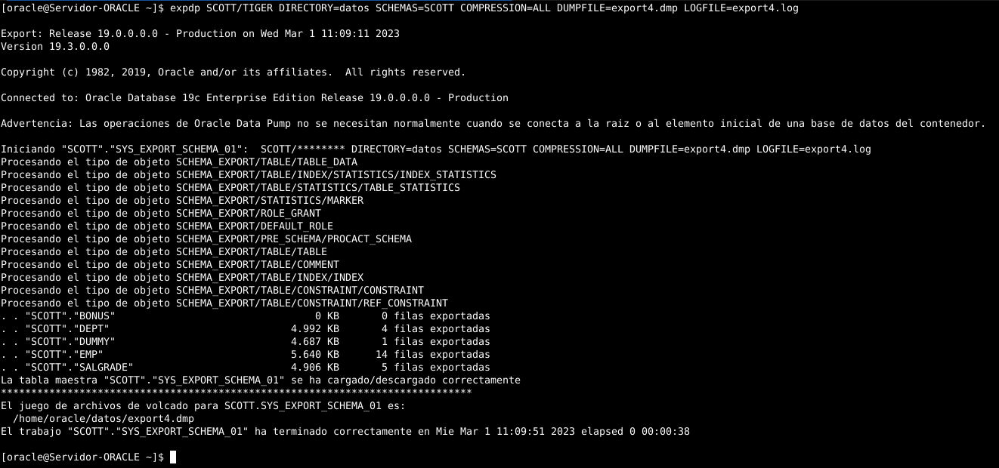
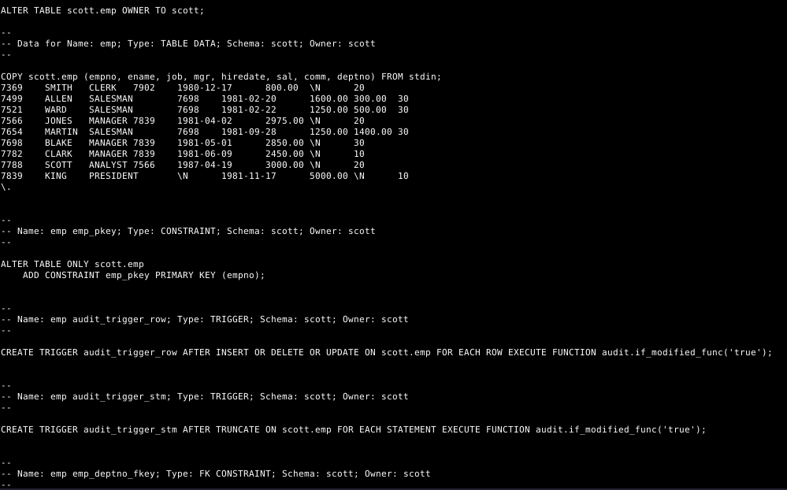
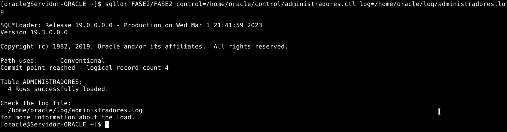

# **ABD**
## **Movimiento de Datos**
#### Realizado por: **Iván Piña Castillo**

-----------------------------------------------------------------------------------------------------------------------------------

## 1. Realiza una exportación del esquema de SCOTT usando Oracle Data Pump con las siguientes condiciones:

    • Exporta tanto la estructura de las tablas como los datos de las mismas.

    • Excluye la tabla BONUS y los departamentos con menos de dos empleados.

    • Realiza una estimación previa del tamaño necesario para el fichero de exportación.

    • Programa la operación para dentro de 2 minutos.

    • Genera un archivo de log en el directorio raíz.

Nos conectamos a la base de datos Oracle que contiene el esquema SCOTT mediante el comando sqlplus:
```java
sqlplus SCOTT/TIGER
```

Verificamos que estamos conectados a la base de datos adecuada usando el comando show user;
```java
show user;
```


Creamos un directorio en el sistema de archivos de Linux donde se almacenará el archivo de exportación y el archivo de registro:
```bash
mkdir /home/oracle/datos
```


Nos dirigimos a SQL*Plus y ejecutamos el siguiente comando para crear el directorio en la base de datos:
```sql
CREATE DIRECTORY datos AS '/home/oracle/datos';
```


Es importante que le demos al usuario SCOTT los permisos necesarios para poder leer y escribir en el directorio creado:
```sql
GRANT READ,WRITE ON DIRECTORY DATOS TO SCOTT;
```

También es necesario darle permisos al usuario SCOTT para poder realizar una exportación completa:
```sql
GRANT DATAPUMP_EXP_FULL_DATABASE TO SCOTT;
```


Realizaremos una estimación previa del tamaño necesario para el archivo de exportación. Para ello, usamos el comando expdp con la opción ESTIMATE_ONLY=y:
```bash
expdp SCOTT/TIGER DIRECTORY=datos CONTENT=ALL LOGFILE=export.log SCHEMAS=SCOTT ESTIMATE_ONLY=y
```


Ahora, usamos el comando expdp para exportar el esquema SCOTT con las condiciones solicitadas:
```bash
expdp SCOTT/TIGER DIRECTORY=datos DUMPFILE=scott.dmp CONTENT=ALL LOGFILE=scott.log SCHEMAS=SCOTT EXCLUDE=TABLE:"IN('BONUS')" QUERY=DEPT:'"WHERE DEPTNO IN (SELECT DEPTNO FROM EMP GROUP BY DEPTNO HAVING COUNT(*) >= 2)"' JOB_NAME=scott_exportacion
```


    DIRECTORY: especifica el nombre del directorio donde se almacenarán el archivo de exportación y el archivo de registro. En este caso, se utiliza "datos".

    DUMPFILE: especifica el nombre del archivo de exportación. En este caso, se utiliza "scott.dmp".

    LOGFILE: especifica el nombre del archivo de registro. En este caso, se utiliza "scott.log" y se guarda en el directorio raíz.

    SCHEMAS: especifica el nombre del esquema que se va a exportar. En este caso, se utiliza "SCOTT". 

    EXCLUDE: especifica que se deben excluir las tablas "BONUS" y los departamentos con menos de dos empleados. En este caso, se utiliza "TABLE:"IN('BONUS')" QUERY=DEPT:'"WHERE DEPTNO IN (SELECT DEPTNO FROM EMP GROUP BY DEPTNO HAVING COUNT(*) >= 2)"'".

    ESTIMATE_ONLY: especifica que solo se debe realizar una estimación del tamaño necesario para el archivo de exportación. En este caso, se utiliza "y".

    JOB_NAME: especifica el nombre del trabajo de exportación. En este caso, se utiliza "scott_exportacion".

Esperaremos a que se complete el trabajo de exportación. El archivo de exportación y el archivo de registro se almacenarán en el directorio datos.
En este caso, la exportación se ha realizado correctamente y el archivo de exportación no ocupa más de 1 MB.


Contenido del fichero de log de la estimación:


Contenido del fichero de log de la exportación:


Contenido del fichero de exportación:


Para programar la operación de exportación para dentro de 2 minutos, primero crearé un script que realice la exportación:
```bash
nano export.sh

#!/bin/bash

# Definimos variables
FECHA=`date +%Y%m%d%H%M%S`
USUARIO=SCOTT
PASSWORD=TIGER
SCHEMA=SCOTT
EXCLUDE=TABLE:"IN('BONUS')"
QUERY=DEPT:'"WHERE DEPTNO IN (SELECT DEPTNO FROM EMP GROUP BY DEPTNO HAVING COUNT(*) >= 2)"'
RUTA_EXPORTACION=/home/oracle/datos
DIRECTORY=datos
NOMBRE_EXPORTACION=exportacion_$FECHA
NOMBRE_ESTIMACION=estimacion_$FECHA

# Realizamos la estimación y la exportación

expdp $USUARIO/$PASSWORD DIRECTORY=$DIRECTORY CONTENT=ALL LOGFILE=$NOMBRE_ESTIMACION.log SCHEMAS=$SCHEMA ESTIMATE_ONLY=y

sleep 10

expdp $USUARIO/$PASSWORD directory=$DIRECTORY dumpfile=$NOMBRE_EXPORTACION.dmp logfile=$NOMBRE_EXPORTACION.log SCHEMAS=$SCHEMA EXCLUDE=$EXCLUDE QUERY=$QUERY JOB_NAME=$NOMBRE_EXPORTACION
```

Deberemos dar permisos de ejecución al script:
```bash
chmod a+x /home/oracle/export.sh
```

Ejecutamos el script para comprobar que funciona correctamente:
```bash
. export.sh
```


-


Ahora programaremos la ejecución del script de exportación en el crontab para que se ejecute dentro de 2 minutos:
```bash
export EDITOR=nano
crontab -e
```
```javascript
*/2 * * * * /home/oracle/export.sh
```


Parece ser que cron no es capaz de ejecutar el script. No he encontrado la solución a este problema. Parece ser que la única forma de programar esta tarea es usando de PL/SQL. para ello, crearemos un paquete PL/SQL que realice la exportación.


## 2. Importa el fichero obtenido anteriormente usando Oracle Data Pump pero en un usuario distinto de la misma base de datos.

Crearé el usuario destino en la base de datos con sus permisos correspondientes:
```sql
alter session set "_ORACLE_SCRIPT"=true;
CREATE USER SCOTTIMPORT IDENTIFIED BY TIGER;
ALTER USER SCOTTIMPORT ACCOUNT UNLOCK;
GRANT CONNECT, RESOURCE TO SCOTTIMPORT;
GRANT UNLIMITED TABLESPACE TO SCOTTIMPORT;
ALTER USER SCOTTIMPORT DEFAULT TABLESPACE USERS;
ALTER USER SCOTTIMPORT TEMPORARY TABLESPACE TEMP;
GRANT READ,WRITE ON DIRECTORY DATOS TO SCOTTIMPORT;
GRANT IMP_FULL_DATABASE TO SCOTTIMPORT;
```

Para realizar la importación, usaremos el comando impdp:
```css
impdp SCOTTIMPORT/TIGER DIRECTORY=datos DUMPFILE=scott.dmp LOGFILE=scott_import.log SCHEMAS=SCOTT REMAP_SCHEMA=SCOTT:SCOTTIMPORT
```


    LOGFILE: especifica el nombre del archivo de registro. En este ejemplo, se utiliza "scott_import.log".
    REMAP_SCHEMA: especifica que se debe cambiar el nombre del esquema de origen "SCOTT" al nombre del esquema destino "SCOTT_IMPORT".

Contenido del fichero de log de la importación:


Probemos a realizar una consulta en el esquema SCOTTIMPORT para comprobar que se han importado los datos correctamente:
```sql
select * from scottimport.emp;
```


Comprobamos que no se han importado los datos de la tabla BONUS:
```sql
select * from scottimport.bonus;
select * from scott.bonus;
select * from bonus;
```


## 3. Realiza una exportación de la estructura de todas las tablas de la base de datos usando el comando expdp de Oracle Data Pump probando al menos cinco de las posibles opciones que ofrece dicho comando y documentándolas adecuadamente.

El comando expdp de Oracle Data Pump se utiliza para realizar exportaciones de objetos y datos en una base de datos Oracle. A continuación, mostraré cinco de las opciones disponibles en expdp que se pueden utilizar:

**SCHEMAS:** Esta opción se utiliza para especificar los esquemas que se deben exportar. Por ejemplo, para exportar solo los esquemas HR y SCOTT, se puede utilizar el siguiente comando:

```javascript
expdp SCOTT/TIGER DIRECTORY=datos SCHEMAS=SCOTT2,SCOTT DUMPFILE=export1.dmp LOGFILE=export1.log
```

Antes de ejecutar el comando, crearé el nuevo esquema:
```sql
alter session set "_ORACLE_SCRIPT"=true;
GRANT CONNECT, RESOURCE, UNLIMITED TABLESPACE TO SCOTT2 IDENTIFIED BY TIGER;
ALTER USER SCOTT2 ACCOUNT UNLOCK;
ALTER USER SCOTT2 DEFAULT TABLESPACE USERS;
ALTER USER SCOTT2 TEMPORARY TABLESPACE TEMP;
CONNECT SCOTT2/TIGER;

CREATE TABLE SUCURSALES
   (	
 	NUM_SUCURSAL NUMBER(1), 
	NOMBRE VARCHAR2(40) NOT NULL, 
	AREA VARCHAR2(35) NOT NULL, 
	PAIS VARCHAR2(25) NOT NULL,
	CONSTRAINT sucursales_pk PRIMARY KEY (NUM_SUCURSAL),
	CONSTRAINT sucursales_u UNIQUE (NOMBRE)
   );

INSERT INTO SUCURSALES VALUES (1, 'Marshall Agency', 'New York', 'EEUU');
INSERT INTO SUCURSALES VALUES (2, 'Williamson Agency', 'London', 'United Kingdom');
INSERT INTO SUCURSALES VALUES (3, 'Rahksa Imperial Corporation', 'Mumbai', 'India');
INSERT INTO SUCURSALES VALUES (4, 'GuruGuru Asociation', 'Bangalore', 'India');
INSERT INTO SUCURSALES VALUES (5, 'Amen Group', 'San Jose', 'Costa Rica');
INSERT INTO SUCURSALES VALUES (6, 'Rococheti Agency', 'Torento', 'Italy');
INSERT INTO SUCURSALES VALUES (7, 'Chennai SL', 'Chennai', 'India');
INSERT INTO SUCURSALES VALUES (8, 'McTavish Agency', 'Hampshair', 'United Kingdom');
INSERT INTO SUCURSALES VALUES (9, 'Snake Corp.', 'Brisban', 'Australia');
```

Tras esto, ya podemos ejecutar el comando expdp:


Vamos a mirar el contenido del fichero de log de exportación:


Como vemos ha exportado correctamente los datos de la tabla SUCURSALES y los del usuario SCOTT original.

**INCLUDE:** Esta opción se utiliza para especificar los tipos de objetos que se deben incluir en la exportación. Por ejemplo, para incluir solo las restricciones en la exportación, se puede utilizar el siguiente comando:

```javascript
expdp SCOTT/TIGER DIRECTORY=datos SCHEMAS=SCOTT INCLUDE=CONSTRAINT DUMPFILE=export2.dmp LOGFILE=export2.log
```


Vamos a mirar el contenido del fichero de log de exportación:


**EXCLUDE:** Esta opción se utiliza para especificar los tipos de objetos que se deben excluir de la exportación. Por ejemplo, para excluir la tabla EMP y las restricciones almacenadas de la exportación, se puede utilizar el siguiente comando:

```javascript
expdp SCOTT/TIGER DIRECTORY=datos SCHEMAS=SCOTT EXCLUDE=TABLE:"IN('EMP')",CONSTRAINT DUMPFILE=export3.dmp LOGFILE=export3.log
```


Vamos a mirar el contenido del fichero de log de exportación:


**COMPRESSION:** Esta opción se utiliza para especificar el nivel de compresión que se debe aplicar a los datos exportados. Los valores válidos son ALL (máxima compresión), METADATA_ONLY (ninguna compresión), y un número del 1 al 9 que indica el nivel de compresión deseado. Por ejemplo, para utilizar el nivel de máximo, se puede utilizar el siguiente comando:

```javascript
expdp SCOTT/TIGER DIRECTORY=datos SCHEMAS=SCOTT COMPRESSION=ALL DUMPFILE=export4.dmp LOGFILE=export4.log
```



Podemos ver que el archivo de exportación es mucho más pequeño que otros que no han sido comprimidos.


Vamos a mirar el contenido del fichero de log de exportación:


**ENCRYPTION_PASSWORD:** Esta opción se utiliza para especificar la contraseña que se debe utilizar para encriptar los datos exportados. Por ejemplo, para utilizar la contraseña "oracle", se puede utilizar el siguiente comando:

```javascript
expdp SCOTT/TIGER DIRECTORY=datos SCHEMAS=SCOTT ENCRYPTION_PASSWORD=oracle DUMPFILE=export5.dmp LOGFILE=export5.log
```


Crearé el usuario destino en la base de datos con sus permisos correspondientes:
```sql
alter session set "_ORACLE_SCRIPT"=true;
CREATE USER SCOTTIMPORT2 IDENTIFIED BY TIGER;
ALTER USER SCOTTIMPORT2 ACCOUNT UNLOCK;
GRANT CONNECT, RESOURCE TO SCOTTIMPORT2;
GRANT UNLIMITED TABLESPACE TO SCOTTIMPORT2;
ALTER USER SCOTTIMPORT2 DEFAULT TABLESPACE USERS;
ALTER USER SCOTTIMPORT2 TEMPORARY TABLESPACE TEMP;
GRANT READ,WRITE ON DIRECTORY DATOS TO SCOTTIMPORT2;
GRANT IMP_FULL_DATABASE TO SCOTTIMPORT2;
```

Ahora trataremos de importar el archivo de exportación que acabamos de crear:
```javascript
impdp SCOTTIMPORT2/TIGER DIRECTORY=datos DUMPFILE=export5.dmp LOGFILE=import5.log
```


Como vemos debemos poner un parámetro con la contraseña para desencriptar los datos. Si no se especifica, se mostrará el error anterior.

```javascript
impdp SCOTTIMPORT2/TIGER DIRECTORY=datos DUMPFILE=export5.dmp LOGFILE=import5.log ENCRYPTION_PASSWORD=oracle
```


Ahora podemos ver que se ha importado correctamente el archivo de exportación.

Estos son solo algunos ejemplos de las opciones disponibles en expdp. Es importante revisar la documentación de Oracle para conocer todas las opciones y cómo utilizarlas adecuadamente según las necesidades de cada caso de uso, ya que todo esto que acabo de explicar es solo una pequeña parte de lo que expdp puede hacer.

También podemos mirar la salida del comando expdp help=y para ver todas las opciones disponibles y su descripción:


## 4. Intenta realizar operaciones similares de importación y exportación con las herramientas proporcionadas con MySQL desde línea de comandos, documentando el proceso.

MySQL proporciona una herramientas para exportar datos desde la línea de comandos: mysqldump.

**Exportación de datos con mysqldump**

mysqldump es una herramienta que se utiliza para realizar copias de seguridad de bases de datos MySQL. Permite exportar toda la base de datos o solo una selección de tablas, vistas o rutinas almacenadas. Para realizar una exportación completa de una base de datos, se puede utilizar el siguiente comando:

```css
mysqldump -u scott -p scott > exportacion_scott.sql
```


Este comando creará un archivo llamado exportacion_scott.sql que contiene todas las instrucciones SQL necesarias para recrear la base de datos y sus datos.

Vamos a ver el contenido del archivo exportacion_scott.sql:


-

-


También es posible exportar solo una selección de tablas utilizando la opción --tables. Por ejemplo, para exportar solo la tabla emp, se puede utilizar el siguiente comando:

```css
mysqldump -u scott -p --tables scott EMP > exportacion2_scott.sql
```


El archivo exportacion.sql contendrá solo las instrucciones SQL necesarias para recrear la tabla EMP y sus datos.


-


**Importación de datos con mysql**

En esta ocasión utilizaremos el comando mysql.

Crearemos un nuevo usuario llamado y base de datos llamados scottimport que tendrá permisos para importar datos a la base de datos scott:
```sql
CREATE DATABASE scottimport;
CREATE USER scottimport IDENTIFIED BY 'tiger';
GRANT ALL PRIVILEGES ON scottimport.* TO scottimport;
FLUSH PRIVILEGES;
```

Para importar el archivo exportacion_scott.sql que acabamos de crear, se puede utilizar el siguiente comando:
```css
mysql -u scottimport -p scottimport < exportacion_scott.sql
```


Vamos a comprobar que se han importado correctamente los datos:
```sql
SELECT * FROM EMP;
```


## 5. Intenta realizar operaciones similares de importación y exportación con las herramientas proporcionadas con Postgres desde línea de comandos, documentando el proceso.

PostgreSQL proporciona una herramientas para exportar datos desde la línea de comandos: pg_dump.

**Exportación de datos con pg_dump**

pg_dump es una herramienta que se utiliza para realizar copias de seguridad de bases de datos PostgreSQL. Permite exportar toda la base de datos o solo una selección de tablas, vistas o funciones. Para realizar una exportación completa de una base de datos, se puede utilizar el siguiente comando:

```r
pg_dump -U postgres scott > exportacion_scott.sql
```


Este comando creará un archivo llamado exportacion_scott.sql que contiene toda la estructura y los datos de la base de datos.

Vamos a ver el contenido del archivo exportacion_scott.sql:


-


Como vemos nos ha exportado incluso las tablas que se crearon para auditoría.

También es posible exportar solo una selección de tablas utilizando la opción --table. Por ejemplo, para exportar solo la tabla emp, se puede utilizar el siguiente comando:
```r
pg_dump -U postgres --table scott.emp > exportacion2_scott.sql
```


El archivo exportacion2_scott.sql contendrá solo la estructura y los datos de la tabla emp.


-


**Importación de datos con PostgreSQL**

En esta ocasión utilizaremos el comando psql.

Crearemos una nueva base de datos llamada scott2.

Hecho eso, vamos a importar el archivo exportacion_scott.sql que acabamos de crear, se puede utilizar el siguiente comando:
```r
psql -U postgres -d scott2 -f exportacion_scott.sql
```


El archivo exportacion_scott.sql ha creado la siguiente estructura:


-


Vamos a hacer una consulta para comprobar que se han importado correctamente los datos:
```sql
SELECT * FROM emp;
```


## 6. Exporta los documentos de una colección de MongoDB que cumplan una determinada condición e impórtalos en otra base de datos.

Para exportar los documentos de una colección en MongoDB que cumplan una determinada condición, podemos utilizar el comando mongoexport con opciones adicionales.

Supongamos que tenemos una colección llamada prueba1 en la base de datos Practica y queremos exportar todos los documentos que tengan una edad mayor a 25 años. Para ello, podemos utilizar el siguiente comando:

(Esta base de datos es la que he usado):
```java
mongosh -u admin -p admin --authenticationDatabase admin
use Practica
db.createCollection("prueba1")
db.prueba1.insertMany( [
  { nombre: "Ivan", edad: 20 },
  { nombre: "Pepito", edad: 18 },
  { nombre: "Luisa", edad: 18 },
  { nombre: "Antonia", edad: 18 },
  { nombre: "Matilda", edad: 18 },
  { nombre: "Belen", edad: 18 },
  { nombre: "Juanje", edad: 24 },
  { nombre: "Paco", edad: 26 },
  { nombre: "Pepe", edad: 30 },
  { nombre: "Manolo", edad: 32 },
  { nombre: "Antonio", edad: 34 },
  { nombre: "Jose", edad: 40 },
  { nombre: "Ramon", edad: 38 },
  { nombre: "Luis", edad: 40 },
  { nombre: "Pedro", edad: 42 },
  { nombre: "Javier", edad: 44 },
  { nombre: "Jorge", edad: 46 },
  { nombre: "Alberto", edad: 48 },
  { nombre: "Raul", edad: 50 },
  { nombre: "Fernando", edad: 52 },
  { nombre: "Miguel", edad: 54 },
  { nombre: "Carlos", edad: 56 },
  { nombre: "Francisco", edad: 58 },
  { nombre: "Joaquin", edad: 60 },
  { nombre: "Sergio", edad: 62 },
  { nombre: "Ricardo", edad: 64 },
  { nombre: "Javier", edad: 66 }
] )

```bash
mongoexport -u admin -p admin --db Practica --collection prueba1 --query '{ "edad": { "$gt": 25 } }' --out exportacion_prueba1.json --authenticationDatabase admin
```


Este comando creará un archivo de copia de seguridad en el directorio actual de la terminal. El nombre del archivo dependerá de la fecha y hora de la exportación. Además, los datos se almacenarán en formato JSON.

Vamos a ver el contenido del archivo exportacion_prueba1.json:


Para importar los datos en otra base de datos, podemos utilizar el comando mongoimport. Supongamos que queremos importar los datos en una nueva base de datos llamada Practica2. Podemos utilizar el siguiente comando:

(Antes crearé la base de datos Practica2):
```java
mongosh -u admin -p admin --authenticationDatabase admin
use Practica2
```

```bash
mongoimport -u admin -p admin --db Practica2 --collection prueba2 --type json --file exportacion_prueba1.json --authenticationDatabase admin
```


Este comando importará los datos en la colección clientes de la base de datos Practica2, también nos creará la colleción que hemos especificado. Es importante especificar la ruta completa del archivo JSON generado en la exportación.

Vamos a ver el contenido de la colección prueba2:
```java
mongosh -u admin -p admin --authenticationDatabase admin
use Practica2
db.prueba2.find()
```


Como vemos, los primeros registros que no cumplian la condición de la consulta, no se han importado.

## 7. SQL Loader es una herramienta que sirve para cargar grandes volúmenes de datos en una instancia de ORACLE. Exportad los datos de una base de datos completa desde Postgres a texto plano con delimitadores y emplead SQL Loader para realizar el proceso de carga de dichos datos a una instancia ORACLE. Debéis documentar todo el proceso, explicando los distintos ficheros de configuración y de log que tiene SQL*Loader.

Para exportar los datos de una base de datos completa de Postgres a texto plano con delimitadores, podemos utilizar el siguiente comando:
```sql
COPY comunidades TO '/var/lib/postgresql/sqlloader/comunidades.csv' DELIMITERS',';
COPY administradores TO '/var/lib/postgresql/sqlloader/administradores.csv' DELIMITERS',';
COPY contratos_de_mandato TO '/var/lib/postgresql/sqlloader/contratos_de_mandato.csv' DELIMITERS',';
COPY propietarios TO '/var/lib/postgresql/sqlloader/propietarios.csv' DELIMITERS',';
COPY historial_cargos TO '/var/lib/postgresql/sqlloader/historial_cargos.csv' DELIMITERS',';
COPY recibos_cuotas TO '/var/lib/postgresql/sqlloader/recibos_cuotas.csv' DELIMITERS',';
COPY propiedades TO '/var/lib/postgresql/sqlloader/propiedades.csv' DELIMITERS',';
COPY inquilinos TO '/var/lib/postgresql/sqlloader/inquilinos.csv' DELIMITERS',';
COPY oficinas TO '/var/lib/postgresql/sqlloader/oficinas.csv' DELIMITERS',';
COPY locales TO '/var/lib/postgresql/sqlloader/locales.csv' DELIMITERS',';
COPY horarios_apertura TO '/var/lib/postgresql/sqlloader/horarios_apertura.csv' DELIMITERS',';
COPY viviendas TO '/var/lib/postgresql/sqlloader/viviendas.csv' DELIMITERS',';
```


Una vez que tenemos el archivo de texto plano con los datos, podemos utilizar SQL*Loader para cargarlos en una instancia de Oracle.


SQLLoader es una herramienta de línea de comandos que utiliza archivos de configuración para especificar los detalles de la carga de datos. A continuación detallaré el proceso completo de configuración y uso de SQLLoader para cargar los datos exportados de Postgres a mi instancia de Oracle.

Crearemos las tablas en Oracle de forma que coincidan con las estructuras de las tablas de Postgres. Es importante que los nombres de las columnas coincidan exactamente y que los tipos de datos sean compatibles.
```sql
GRANT CONNECT, RESOURCE, UNLIMITED TABLESPACE TO FASE2 IDENTIFIED BY FASE2;
ALTER USER FASE2 ACCOUNT UNLOCK;
ALTER USER FASE2 DEFAULT TABLESPACE USERS;
ALTER USER FASE2 TEMPORARY TABLESPACE TEMP;
ALTER USER FASE2 PROFILE DEFAULT;
CONNECT FASE2/FASE2

CREATE TABLE comunidades
(
codcomunidad		VARCHAR2(8),
nombre				VARCHAR2(20),
calle				VARCHAR2(35),
poblacion			VARCHAR2(30),
codigopostal		VARCHAR2(5),
CONSTRAINT pk_codcomunidad PRIMARY KEY (codcomunidad),
CONSTRAINT poblacionok CHECK (poblacion LIKE '%(Sevilla)' OR poblacion LIKE '%(Cadiz)' OR poblacion LIKE '%(Huelva)' OR poblacion LIKE '%(Cordoba)'),
CONSTRAINT comunidadesok CHECK(REGEXP_LIKE(codcomunidad,'[A-Z]{4,8}'))
);


CREATE TABLE administradores(
numcolegiado		VARCHAR2(5),
dni					VARCHAR2(9),
nombre				VARCHAR2(20),
apellidos			VARCHAR2(20),
CONSTRAINT pk_numcolegiado PRIMARY KEY (numcolegiado),
CONSTRAINT dni_unico unique(dni)
);


CREATE TABLE contratos_de_mandato(
codcontrato			VARCHAR2(6),
numcolegiado		VARCHAR2(5),
fecha_inicio		DATE,
fecha_final			DATE,
honorarios_anuales	NUMERIC,
codcomunidad		VARCHAR2(8),
CONSTRAINT pk_codcontrato PRIMARY KEY (codcontrato),
CONSTRAINT fk_numcolegiado FOREIGN KEY (numcolegiado) REFERENCES administradores (numcolegiado),
CONSTRAINT fk_codcomunidad FOREIGN KEY (codcomunidad) REFERENCES comunidades (codcomunidad),
CONSTRAINT codcontratook CHECK(REGEXP_LIKE(codcontrato,'^[A-Z]{2}[0-9]{4}'))
);


CREATE TABLE propietarios(
dni					VARCHAR2(9),
nombre				VARCHAR2(20),
apellidos			VARCHAR2(20),
direccion			VARCHAR2(40),
localidad			VARCHAR2(35),
provincia			VARCHAR2(20),
tlf_contacto		VARCHAR2(9),
CONSTRAINT pk_propietario PRIMARY KEY (dni),
CONSTRAINT apellidosok CHECK(INITCAP(apellidos)=apellidos)
);


CREATE TABLE historial_cargos(
nombre_cargo		VARCHAR2(20),
codcomunidad		VARCHAR2(8),
dni					VARCHAR2(9),
fecha_inicio		DATE,
fecha_fin 			DATE,
CONSTRAINT pk_hcargo PRIMARY KEY(nombre_cargo, codcomunidad, dni,fecha_inicio),
CONSTRAINT fk_hcomunidad FOREIGN KEY(codcomunidad) REFERENCES comunidades (codcomunidad),
CONSTRAINT fk_hpropietario FOREIGN KEY(dni) REFERENCES propietarios(dni),
CONSTRAINT fecha_ok CHECK (TO_CHAR(fecha_inicio,'mmdd')NOT BETWEEN '0209' AND '1231')
);


CREATE TABLE recibos_cuotas(
numrecibo			VARCHAR2(4),
codcomunidad		VARCHAR2(8),
dni					VARCHAR2(9),
fecha 				DATE,
importe				NUMBER,
pagado				VARCHAR(9),
CONSTRAINT pk_numrecibo PRIMARY KEY (numrecibo,codcomunidad),
CONSTRAINT fk_recomunidad  FOREIGN KEY (codcomunidad) REFERENCES comunidades(codcomunidad),
CONSTRAINT fk_repropietario FOREIGN KEY (dni) REFERENCES propietarios(dni)
);


CREATE TABLE propiedades(
codcomunidad		VARCHAR2(8),
codpropiedad		VARCHAR2(4),
dni_propietario		VARCHAR2(9),
portal				VARCHAR2(3),
planta				VARCHAR2(7),
letra				VARCHAR2(1),
porcentaje_participacion NUMBER(5,2),
CONSTRAINT pk_propiedad PRIMARY KEY (codcomunidad,codpropiedad),
CONSTRAINT fk_propropietrio FOREIGN KEY (dni_propietario) REFERENCES propietarios(dni),
CONSTRAINT fk_procomunidad FOREIGN KEY (codcomunidad) REFERENCES comunidades(codcomunidad),
CONSTRAINT propiedadok CHECK(REGEXP_LIKE(codpropiedad,'[0-9]{4}'))
);


CREATE TABLE inquilinos(
dni 				VARCHAR2(9),
codpropiedad		VARCHAR2(4),
codcomunidad		VARCHAR2(8),
nombre 				VARCHAR2(20),
apellidos			VARCHAR2(20),
tlf_contacto		VARCHAR2(9),
CONSTRAINT pk_inquilino PRIMARY KEY (dni),
CONSTRAINT fk_inpropiedad FOREIGN KEY (codpropiedad,codcomunidad) REFERENCES propiedades(codpropiedad,codcomunidad),
CONSTRAINT utlf_contacto UNIQUE(tlf_contacto),
CONSTRAINT inquilinodniok CHECK(REGEXP_LIKE(dni,'^[0-9]{8}[A-Z]') or REGEXP_LIKE(dni,'^[KLMXYZ]{1}[0-9]{7}[A-Z]{1}'))
);


CREATE TABLE oficinas(
codpropiedad		VARCHAR2(4),
codcomunidad		VARCHAR2(8),
actividad			VARCHAR2(30),
CONSTRAINT pk_oficinas PRIMARY KEY (codpropiedad,codcomunidad),
CONSTRAINT fk_ofpropiedad FOREIGN KEY (codpropiedad,codcomunidad) REFERENCES propiedades(codpropiedad,codcomunidad)
);


CREATE TABLE locales(
codpropiedad		VARCHAR2(4),
codcomunidad		VARCHAR2(8),
CONSTRAINT pk_locales PRIMARY KEY (codpropiedad,codcomunidad),
CONSTRAINT fk_locpropiedad FOREIGN KEY (codpropiedad,codcomunidad) REFERENCES propiedades(codpropiedad,codcomunidad)
);


CREATE TABLE horarios_apertura(
codcomunidad		VARCHAR2(8),
codpropiedad		VARCHAR2(4),
diasemana			VARCHAR2(9),
hora_apertura 		TIMESTAMP,
hora_cierre			TIMESTAMP,
CONSTRAINT pk_horario PRIMARY KEY (codpropiedad,codcomunidad,diasemana,hora_apertura),
CONSTRAINT fk_hopropiedad FOREIGN KEY (codpropiedad,codcomunidad) REFERENCES propiedades(codpropiedad,codcomunidad),
CONSTRAINT hora_aperturaok CHECK((to_char(hora_apertura,'hh24:mi')BETWEEN '06:00' AND '23:00'))
);


CREATE TABLE viviendas(
codpropiedad		VARCHAR2(4),
codcomunidad		VARCHAR2(8),
numhabitaciones		VARCHAR2(2),
CONSTRAINT pk_viviendas PRIMARY KEY (codpropiedad,codcomunidad),
CONSTRAINT fk_vipropiedad FOREIGN KEY (codpropiedad,codcomunidad) REFERENCES propiedades(codpropiedad,codcomunidad)
);
```

Crearemos un archivo de control para cada tabla para SQL*Loader y los guardaremos en la carpeta /home/oracle/control
```bash
nano comunidades.ctl
```
```bash
LOAD DATA
INFILE '/home/oracle/sqlloader/comunidades.csv'
INTO TABLE comunidades
FIELDS TERMINATED BY ','
TRAILING NULLCOLS
(codcomunidad, nombre, calle, poblacion, codigopostal)
```
```bash
nano administradores.ctl
```
```bash
LOAD DATA
INFILE '/home/oracle/sqlloader/administradores.csv'
INTO TABLE administradores
FIELDS TERMINATED BY ','
TRAILING NULLCOLS
(numcolegiado, dni, nombre, apellidos)
```
```bash
nano contratos.ctl
```
```bash
LOAD DATA
INFILE '/home/oracle/sqlloader/contratos_de_mandato.csv'
INTO TABLE contratos_de_mandato
FIELDS TERMINATED BY ','
TRAILING NULLCOLS
(codcontrato, numcolegiado, fecha_inicio, fecha_final, honorarios_anuales, codcomunidad)
```
```bash
nano propietarios.ctl
```
```bash
LOAD DATA
INFILE '/home/oracle/sqlloader/propietarios.csv'
INTO TABLE propietarios
FIELDS TERMINATED BY ','
TRAILING NULLCOLS
(dni, nombre, apellidos, direccion, localidad, provincia, tlf_contacto)
```
```bash
nano historial_cargos.ctl
```
```bash
LOAD DATA
INFILE '/home/oracle/sqlloader/historial_cargos.csv'
INTO TABLE historial_cargos
FIELDS TERMINATED BY ','
TRAILING NULLCOLS
(nombre_cargo, codcomunidad, dni, fecha_inicio, fecha_fin)
```
```bash
nano recibos_cuotas.ctl
```
```bash
LOAD DATA
INFILE '/home/oracle/sqlloader/recibos_cuotas.csv'
INTO TABLE recibos_cuotas
FIELDS TERMINATED BY ','
TRAILING NULLCOLS
(numrecibo, codcomunidad, dni, fecha, importe, pagado)
```
```bash
nano propiedades.ctl
```
```bash
LOAD DATA
INFILE '/home/oracle/sqlloader/propiedades.csv'
INTO TABLE propiedades
FIELDS TERMINATED BY ','
TRAILING NULLCOLS
(codcomunidad, codpropiedad, dni_propietario, portal, planta, letra, porcentaje_participacion)
```
```bash
nano inquilinos.ctl
```
```bash
LOAD DATA
INFILE '/home/oracle/sqlloader/inquilinos.csv'
INTO TABLE inquilinos
FIELDS TERMINATED BY ','
TRAILING NULLCOLS
(dni, codpropiedad, codcomunidad, nombre, apellidos, tlf_contacto)
```
```bash
nano oficinas.ctl
```
```bash
LOAD DATA
INFILE '/home/oracle/sqlloader/oficinas.csv'
INTO TABLE oficinas
FIELDS TERMINATED BY ','
TRAILING NULLCOLS
(codpropiedad, codcomunidad, actividad)
```
```bash
nano locales.ctl
```
```bash
LOAD DATA
INFILE '/home/oracle/sqlloader/locales.csv'
INTO TABLE locales
FIELDS TERMINATED BY ','
TRAILING NULLCOLS
(codpropiedad, codcomunidad)
```
```bash
nano horarios_apertura.ctl
```
```bash
LOAD DATA
INFILE '/home/oracle/sqlloader/horarios_apertura.csv'
INTO TABLE horarios_apertura
FIELDS TERMINATED BY ','
TRAILING NULLCOLS
(codcomunidad, codpropiedad, diasemana, hora_apertura, hora_cierre)
```
```bash
nano viviendas.ctl
```
```bash
LOAD DATA
INFILE '/home/oracle/sqlloader/viviendas.csv'
INTO TABLE viviendas
FIELDS TERMINATED BY ','
TRAILING NULLCOLS
(codpropiedad, codcomunidad, numhabitaciones)
```


Las opciones que hemos utilizado son:

**LOAD DATA:** Indica que vamos a cargar datos.

**INFILE:** Indica el archivo de datos que vamos a cargar.

**INTO TABLE:** Indica la tabla a la que vamos a cargar los datos.

**FIELDS TERMINATED BY:** Indica el carácter que separa los campos.

**TRAILING NULLCOLS:** Indica que los campos vacíos se rellenan con NULL.

**(campos):** Indica los campos de la tabla a los que se van a cargar los datos.

Ejecutaremos SQL*Loader desde la línea de comandos con los archivos de control y parámetros especificados.
```bash
sqlldr FASE2/FASE2 control=/home/oracle/control/comunidades.ctl log=/home/oracle/log/comunidades.log
sqlldr FASE2/FASE2 control=/home/oracle/control/administradores.ctl log=/home/oracle/log/administradores.log
sqlldr FASE2/FASE2 control=/home/oracle/control/contratos.ctl log=/home/oracle/log/contratos.log
sqlldr FASE2/FASE2 control=/home/oracle/control/propietarios.ctl log=/home/oracle/log/propietarios.log
sqlldr FASE2/FASE2 control=/home/oracle/control/historial_cargos.ctl log=/home/oracle/log/historial_cargos.log
sqlldr FASE2/FASE2 control=/home/oracle/control/recibos_cuotas.ctl log=/home/oracle/log/recibos_cuotas.log
sqlldr FASE2/FASE2 control=/home/oracle/control/propiedades.ctl log=/home/oracle/log/propiedades.log
sqlldr FASE2/FASE2 control=/home/oracle/control/inquilinos.ctl log=/home/oracle/log/inquilinos.log
sqlldr FASE2/FASE2 control=/home/oracle/control/oficinas.ctl log=/home/oracle/log/oficinas.log
sqlldr FASE2/FASE2 control=/home/oracle/control/locales.ctl log=/home/oracle/log/locales.log
sqlldr FASE2/FASE2 control=/home/oracle/control/horarios_apertura.ctl log=/home/oracle/log/horarios_apertura.log
sqlldr FASE2/FASE2 control=/home/oracle/control/viviendas.ctl log=/home/oracle/log/viviendas.log
```

Mostraré solo la prueba de la tabla administradores, pero el resto de tablas se han cargado de la misma forma.

Primero al ejecutar el comando nos aparecerá el siguiente mensaje:



Si nos vamos a la carpeta de logs, veremos que se ha creado un archivo de log que contiene información sobre la carga de datos.


Acto seguido accederé a la base de datos y comprobaré que se han cargado los datos correctamente.


Trabajando con esta herramienta, he llegado a la conclusión de su gran utilidad, ya que nos permite cargar datos de forma rápida y sencilla, además de que nos permite cargar datos de archivos de texto, lo que nos permite trabajar con datos de diferentes fuentes. Además, nos permite cargar datos en tablas que contienen claves foráneas, lo que nos permite cargar datos en tablas que contienen relaciones.

El haber sufrido un poco al tener que hacerlo todo comando a comando me ha hecho pensar que tal vez existan procedimientos/funciones y scripts bash que nos permitan automatizar el proceso de carga de datos, pero debido a la falta de tiempo no he podido investigar al respecto.
